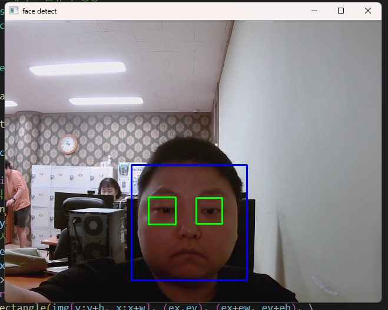

## 🟥 Haarcascade

### 📷 #1 Python Code (1_haar_face.py)

1. This project detects face and eyes from a human image.

이 프로젝트는 사람 이미지에서 얼굴과 눈을 검출해내는 것입니다.

```python
import numpy as np
import cv2

# 얼굴 검출을 위한 케스케이드 분류기 생성 --- ①
face_cascade = cv2.CascadeClassifier('../data/haarcascade_frontalface_default.xml')
# 눈 검출을 위한 케스케이드 분류기 생성 ---②
eye_cascade = cv2.CascadeClassifier('../data/haarcascade_eye.xml')
# 검출할 이미지 읽고 그레이 스케일로 변환 ---③
img = cv2.imread('../img/maelle.jpg')
gray = cv2.cvtColor(img, cv2.COLOR_BGR2GRAY)
# 얼굴 검출 ---④
faces = face_cascade.detectMultiScale(gray)
# 검출된 얼굴 순회 ---⑤
for (x,y,w,h) in faces:
    # 검출된 얼굴에 사각형 표시 ---⑥
    cv2.rectangle(img,(x,y),(x+w,y+h),(255,0,0),2)
    # 얼굴 영역을 ROI로 설정 ---⑦
    roi = gray[y:y+h, x:x+w]
    # ROI에서 눈 검출 ---⑧
    eyes = eye_cascade.detectMultiScale(roi)
    # 검출된 눈에 사각형 표 ---⑨
    for (ex,ey,ew,eh) in eyes:
        cv2.rectangle(img[y:y+h, x:x+w],(ex,ey),(ex+ew,ey+eh),(0,255,0),2)
# 결과 출력 
cv2.imshow('img',img)
cv2.waitKey(0)
cv2.destroyAllWindows()

```

---

<br>


2. To detect face and eyes, you will need these cascade classifiers. Put them in the data folder.

얼굴과 눈을 검출하기 위해선, 이 캐스케이드 분류기가 필요합니다. 그것들을 data 폴더 안에 넣으세요.

<br><br>


3. When the code is executed, the face will be detected with a blue rectangular outline and the eyes  
will be detected with green outlines.

코드가 실행되면, 얼굴은 파란색 사각형으로, 눈은 초록색 사각형으로 각각 검출될 것입니다.

---

<br>

### 📷 #2 Python Code (2_haar_face_cam.py)

1. This project detects face and eyes through cam screen on live.

이 프로젝트는 카메라 화면을 통해서 실시간으로 얼굴과 눈을 검출하는 것입니다.

```python
import cv2

# 얼굴과  검출을 위한 케스케이드 분류기 생성 
face_cascade = cv2.CascadeClassifier('../data/haarcascade_frontalface_default.xml')
eye_cascade = cv2.CascadeClassifier('../data/haarcascade_eye.xml')

# 카메라 캡쳐 활성화
cap = cv2.VideoCapture(1)
while cap.isOpened():    
    ret, img = cap.read()  # 프레임 읽기
    if ret:
        gray = cv2.cvtColor(img, cv2.COLOR_BGR2GRAY)
        # 얼굴 검출    
        faces = face_cascade.detectMultiScale(gray, scaleFactor=1.3, \
                                        minNeighbors=5, minSize=(80,80))
        for(x,y,w,h) in faces:
            # 얼굴 인식 시, 파란색 사각형
            cv2.rectangle(img, (x,y), (x+w, y+h), (255, 0, 0),2)
            roi = gray[y:y+h, x:x+w]
            # 눈 검출 시, 초록색 사각형
            eyes = eye_cascade.detectMultiScale(roi)
            for i, (ex, ey, ew, eh) in enumerate(eyes):
                if i >= 2:
                    break
                cv2.rectangle(img[y:y+h, x:x+w], (ex,ey), (ex+ew, ey+eh), \
                                    (0, 255, 0),2)
        cv2.imshow('face detect', img)
    else:
        break
    # ESC 누르면 종료
    if cv2.waitKey(5) == 27:
        break
cv2.destroyAllWindows()

```
---

<br>



2. As you can see, when the code is executed, the face and eyes will be detected like 1_haar_face.py.

보시다시피, 코드가 실행되면, 얼굴과 눈이 1_haar_face.py와 똑같이 검출될 것입니다.

---

<br>