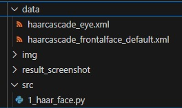
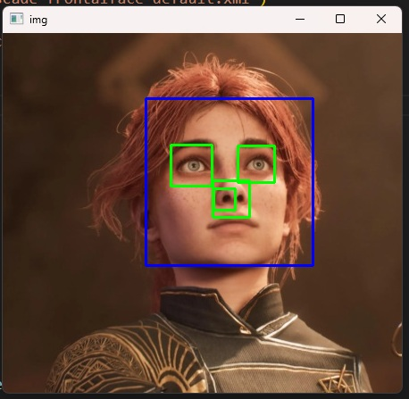

## 🟥 Haarcascade

### 📷 #1 Python Code (1_haar_face.py)

```python
import numpy as np
import cv2

# 얼굴 검출을 위한 케스케이드 분류기 생성 --- ①
face_cascade = cv2.CascadeClassifier('../data/haarcascade_frontalface_default.xml')
# 눈 검출을 위한 케스케이드 분류기 생성 ---②
eye_cascade = cv2.CascadeClassifier('../data/haarcascade_eye.xml')
# 검출할 이미지 읽고 그레이 스케일로 변환 ---③
img = cv2.imread('../img/maelle.jpg')
gray = cv2.cvtColor(img, cv2.COLOR_BGR2GRAY)
# 얼굴 검출 ---④
faces = face_cascade.detectMultiScale(gray)
# 검출된 얼굴 순회 ---⑤
for (x,y,w,h) in faces:
    # 검출된 얼굴에 사각형 표시 ---⑥
    cv2.rectangle(img,(x,y),(x+w,y+h),(255,0,0),2)
    # 얼굴 영역을 ROI로 설정 ---⑦
    roi = gray[y:y+h, x:x+w]
    # ROI에서 눈 검출 ---⑧
    eyes = eye_cascade.detectMultiScale(roi)
    # 검출된 눈에 사각형 표 ---⑨
    for (ex,ey,ew,eh) in eyes:
        cv2.rectangle(img[y:y+h, x:x+w],(ex,ey),(ex+ew,ey+eh),(0,255,0),2)
# 결과 출력 
cv2.imshow('img',img)
cv2.waitKey(0)
cv2.destroyAllWindows()

```

---

<br>



1. To detect face and eyes, you will need these cascade classifiers. Put them in the data folder.

얼굴과 눈을 검출하기 위해선, 이 캐스케이드 분류기가 필요합니다. 그것들을 data 폴더 안에 넣으세요.

<br><br>



2. When the code is executed, the face will be detected with a blue rectangular outline and the eyes  
will be detected with green outlines.

코드가 실행되면, 얼굴은 파란색 사각형으로, 눈은 초록색 사각형으로 각각 검출될 것입니다.

---

<br>

