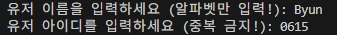
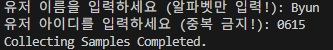
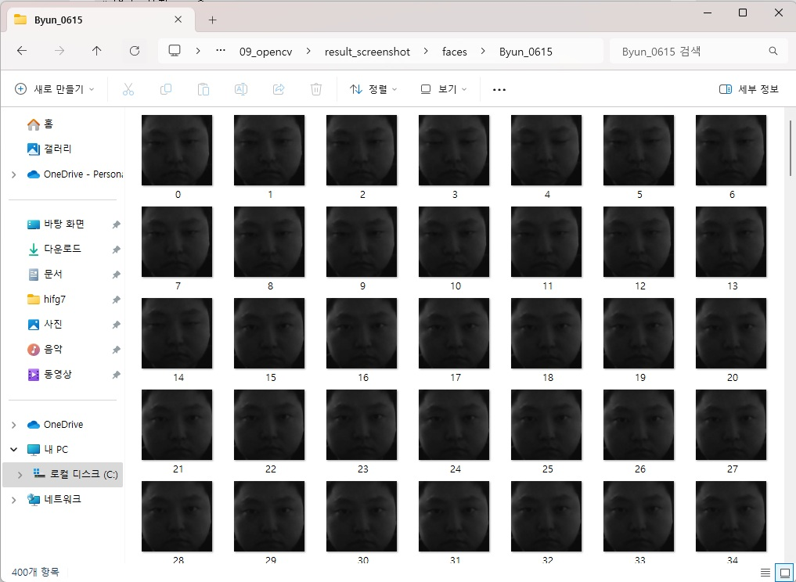
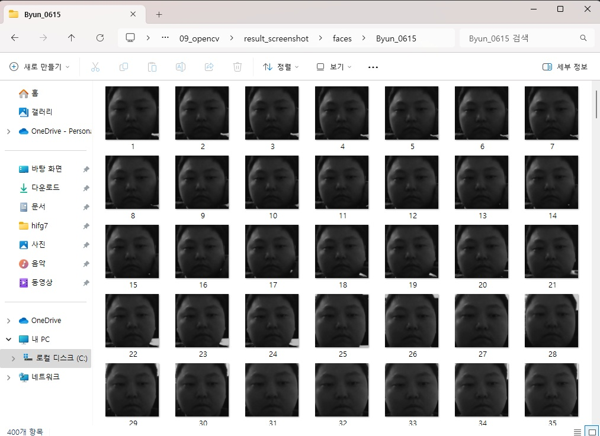

## 🟦 LBPH

### 📷 #1 Python Code (3_lbp_face1_collect.py)

1. This project records up to photos when a face is detected by the camera.

카메라에 얼굴이 잡히면 자동으로 사진을 찍어서 기록하는 프로젝트입니다.

```python
import cv2
import numpy as np
import os 

# 변수 설정 ---①
base_dir = '../result_screenshot/faces/'   # 사진 저장할 디렉토리 경로
target_cnt = 401        # 수집할 사진 갯수
cnt = 1                 # 사진 촬영 수

# 얼굴 검출 분류기 생성 --- ②
face_classifier = cv2.CascadeClassifier(\
                    '../data/haarcascade_frontalface_default.xml')

# 사용자 이름과 번호를 입력 받아 디렉토리 생성 ---③
name = input("유저 이름을 입력하세요 (알파벳만 입력!): ")
id = input("유저 아이디를 입력하세요 (중복 금지!): ")
dir = os.path.join(base_dir, name+'_'+ id)
if not os.path.exists(dir):
    os.mkdir(dir)

# 카메라 캡쳐 
cap = cv2.VideoCapture(1)
cap.set(cv2.CAP_PROP_FRAME_WIDTH, 640)
cap.set(cv2.CAP_PROP_FRAME_HEIGHT, 480)

while cap.isOpened():
    ret, frame = cap.read()
    if ret:
        img = frame.copy()
        gray = cv2.cvtColor(img,cv2.COLOR_BGR2GRAY)
        # 얼굴 검출 --- ④
        faces = face_classifier.detectMultiScale(gray, 1.3, 5)
        if len(faces) == 1:
            (x,y,w,h) = faces[0]
            # 얼굴 영역 표시 및 파일 저장 ---⑤
            cv2.rectangle(frame, (x,y), (x+w, y+h), (0,255,0), 1)
            face = gray[y:y+h, x:x+w]
            face = cv2.resize(face, (200, 200))
            file_name_path = os.path.join(dir,  str(cnt) + '.jpg')
            cv2.imwrite(file_name_path, face)
            cv2.putText(frame, str(cnt), (x, y), cv2.FONT_HERSHEY_COMPLEX, \
                             1, (0,255,0), 2)
            cnt+=1
        else:
            # 얼굴 검출이 없거나 1이상 인 경우 오류 표시 ---⑥
            if len(faces) == 0 :
                msg = "no face."
            elif len(faces) > 1:
                msg = "too many face."
            cv2.putText(frame, msg, (10, 50), cv2.FONT_HERSHEY_DUPLEX, \
                            1, (0,0,255))
        cv2.imshow('face record', frame)
        if cv2.waitKey(1) == 27 or cnt == target_cnt: 
            break
cap.release()
cv2.destroyAllWindows()      
print("얼굴 샘플 수집이 끝났습니다.")

```

---

<br>



2. When the code is executed, input your name(only alphabet) and ID(only number) that you want.

코드가 실행되면, 당신이 원하는 이름(알파벳만 입력)이랑 ID(숫자만 입력)을 입력합니다.

<br><br>



3. After setting name and ID, the camera will take photos of yours whenever it recognizes your face.

이름과 ID를 정했으면, 카메라에 당신의 얼굴이 인식될 때마다 사진이 찍힐 것입니다.

<br><br>



4. It will records up to maximum 400 photos.

최대 400장의 사진까지 기록됩니다.

<br><br>



5. The photos that were recorded are saved in result_screenshot/faces/(name)_(id) directory.

기록된 사진들은 result_screenshot/faces/(name)_(id) 폴더 경로에 저장됩니다.

---