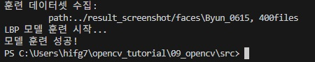
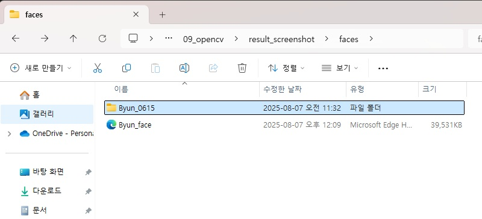
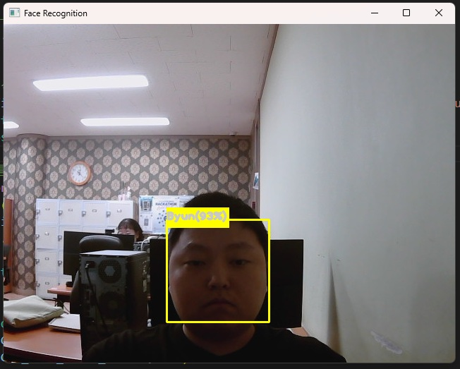

## 🟦 LBPH

### 📷 #1 Python Code (3_lbp_face1_collect.py)

1. This project records up to photos when a face is detected by the camera.

카메라에 얼굴이 잡히면 자동으로 사진을 찍어서 기록하는 프로젝트입니다.

```python
import cv2
import numpy as np
import os 

# 변수 설정 ---①
base_dir = '../result_screenshot/faces/'   # 사진 저장할 디렉토리 경로
target_cnt = 401        # 수집할 사진 갯수
cnt = 1                 # 사진 촬영 수

# 얼굴 검출 분류기 생성 --- ②
face_classifier = cv2.CascadeClassifier(\
                    '../data/haarcascade_frontalface_default.xml')

# 사용자 이름과 번호를 입력 받아 디렉토리 생성 ---③
name = input("유저 이름을 입력하세요 (알파벳만 입력!): ")
id = input("유저 아이디를 입력하세요 (중복 금지!): ")
dir = os.path.join(base_dir, name+'_'+ id)
if not os.path.exists(dir):
    os.mkdir(dir)

# 카메라 캡쳐 
cap = cv2.VideoCapture(1)
cap.set(cv2.CAP_PROP_FRAME_WIDTH, 640)
cap.set(cv2.CAP_PROP_FRAME_HEIGHT, 480)

while cap.isOpened():
    ret, frame = cap.read()
    if ret:
        img = frame.copy()
        gray = cv2.cvtColor(img,cv2.COLOR_BGR2GRAY)
        # 얼굴 검출 --- ④
        faces = face_classifier.detectMultiScale(gray, 1.3, 5)
        if len(faces) == 1:
            (x,y,w,h) = faces[0]
            # 얼굴 영역 표시 및 파일 저장 ---⑤
            cv2.rectangle(frame, (x,y), (x+w, y+h), (0,255,0), 1)
            face = gray[y:y+h, x:x+w]
            face = cv2.resize(face, (200, 200))
            file_name_path = os.path.join(dir,  str(cnt) + '.jpg')
            cv2.imwrite(file_name_path, face)
            cv2.putText(frame, str(cnt), (x, y), cv2.FONT_HERSHEY_COMPLEX, \
                             1, (0,255,0), 2)
            cnt+=1
        else:
            # 얼굴 검출이 없거나 1이상 인 경우 오류 표시 ---⑥
            if len(faces) == 0 :
                msg = "no face."
            elif len(faces) > 1:
                msg = "too many face."
            cv2.putText(frame, msg, (10, 50), cv2.FONT_HERSHEY_DUPLEX, \
                            1, (0,0,255))
        cv2.imshow('face record', frame)
        if cv2.waitKey(1) == 27 or cnt == target_cnt: 
            break
cap.release()
cv2.destroyAllWindows()      
print("얼굴 샘플 수집이 끝났습니다.")

```

---

<br>


2. When the code is executed, input your name(only alphabet) and ID(only number) that you want.

코드가 실행되면, 당신이 원하는 이름(알파벳만 입력)이랑 ID(숫자만 입력)을 입력합니다.

<br><br>


3. After setting name and ID, the camera will take photos of yours whenever it recognizes your face.

이름과 ID를 정했으면, 카메라에 당신의 얼굴이 인식될 때마다 사진이 찍힐 것입니다.

<br><br>


4. It will records up to maximum 400 photos.

최대 400장의 사진까지 기록됩니다.

<br><br>


5. The photos that were recorded are saved in result_screenshot/faces/(name)_(id) directory.

기록된 사진들은 result_screenshot/faces/(name)_(id) 폴더 경로에 저장됩니다.

---

### 📷 #2 Python Code (4_lbp_face2_train.py)

1. Now, take the photos that were recorded and train them using LBPH algorithm model.

이제 기록된 사진들을 가져다가 LBPH 알고리즘 모델을 사용하여 모델링 훈련을 합시다.

```python
import cv2
import numpy as np
import os, glob

# 변수 설정 --- ①
base_dir = '../result_screenshot/faces'
train_data, train_labels = [], []


dirs = [d for d in glob.glob(base_dir+"/*") if os.path.isdir(d)]

print('훈련 데이터셋 수집: ')
for dir in dirs:
    # name_id 형식에서 id를 분리 ---②
    id = dir.split('_')[2]          
    files = glob.glob(dir+'/*.jpg')
    print('\t path:%s, %dfiles'%(dir, len(files)))
    for file in files:
        img = cv2.imread(file, cv2.IMREAD_GRAYSCALE)
        # 이미지는 train_data, 아이디는 train_lables에 저장 ---③
        train_data.append(np.asarray(img, dtype=np.uint8))
        train_labels.append(int(id))

# NumPy 배열로 변환 ---④
train_data = np.asarray(train_data)
train_labels = np.int32(train_labels)

# LBP 얼굴인식기 생성 및 훈련 ---⑤
print('LBP 모델 훈련 시작...')
model = cv2.face.LBPHFaceRecognizer_create()
model.train(train_data, train_labels)
model.write('../result_screenshot/faces/Byun_face.xml')
print("모델 훈련 성공!")

```

---

<br>



2. When the code is executed, the modeling training will be started with collected dataset.

코드가 실행되면, 수집된 데이터셋을 가지고 모델링 훈련이 시작될 것입니다.

<br><br>



3. Once the training is complete, the result will be saved in the faces folder.

훈련이 끝나면, faces 폴더에 결과가 저장될 것입니다.

---

### 📷 #3 Python Code (5_lbp_face2_train.py)

1. Finally, let's check the camera whether it recognizes our face or not.

최종적으로, 카메라가 우리 얼굴을 인식하는지 못하는지 확인해봅시다.

```python
import cv2
import numpy as np
import os, glob

# 변수 설정 ---①
base_dir = '../result_screenshot/faces'
min_accuracy = 85

# LBP 얼굴 인식기 및 케스케이드 얼굴 검출기 생성 및 훈련 모델 읽기 ---②
face_classifier = cv2.CascadeClassifier('../data/haarcascade_frontalface_default.xml')
model = cv2.face.LBPHFaceRecognizer_create()
model.read(os.path.join(base_dir, 'Byun_face.xml'))

# 디렉토리 이름으로 사용자 이름과 아이디 매핑 정보 생성 ---③
dirs = [d for d in glob.glob(base_dir+"/*") if os.path.isdir(d)]
names = dict([])
for dir in dirs:
    dir = os.path.basename(dir)
    name, id = dir.split('_')
    names[int(id)] = name

# 카메라 캡처 장치 준비 
cap = cv2.VideoCapture(1)
cap.set(cv2.CAP_PROP_FRAME_WIDTH, 640)
cap.set(cv2.CAP_PROP_FRAME_HEIGHT, 480)

while cap.isOpened():
    ret, frame = cap.read()
    if not ret:
        print("프레임 없음")
        break
    gray = cv2.cvtColor(frame,cv2.COLOR_BGR2GRAY)
    # 얼굴 검출 ---④
    faces = face_classifier.detectMultiScale(gray, 1.3, 5)
    for (x,y,w,h) in faces:
        # 얼굴 영역 표시하고 샘플과 같은 크기로 축소 ---⑤
        cv2.rectangle(frame,(x,y),(x+w,y+h),(0,255,255),2)
        face = frame[y:y+h, x:x+w]
        face = cv2.resize(face, (200, 200))
        face = cv2.cvtColor(face, cv2.COLOR_BGR2GRAY)
        # LBP 얼굴 인식기로 예측 ---⑥
        label, confidence = model.predict(face)
        if confidence < 400:
            # 정확도 거리를 퍼센트로 변환 ---⑦
            accuracy = int( 100 * (1 -confidence/400))
            if accuracy >= min_accuracy:
                msg =  '%s(%.0f%%)'%(names[label], accuracy)
            else:
                msg = 'Unknown'
        # 사용자 이름과 정확도 결과 출력 ---⑧
        txt, base = cv2.getTextSize(msg, cv2.FONT_HERSHEY_PLAIN, 1, 3)
        cv2.rectangle(frame, (x,y-base-txt[1]), (x+txt[0], y+txt[1]), \
                    (0,255,255), -1)
        cv2.putText(frame, msg, (x, y), cv2.FONT_HERSHEY_PLAIN, 1, \
                    (200,200,200), 2,cv2.LINE_AA)
    cv2.imshow('Face Recognition', frame)

    # ESC 누르면 종료
    if cv2.waitKey(1) == 27:
        break
cap.release()
cv2.destroyAllWindows()

```

---

<br>



2. If there was no issue with modeling training or dataset, the camera will able to recognize  
your face without any problem.

모델링 훈련이나 데이터셋에 문제가 없었다면, 카메라가 당신의 얼굴을 문제없이 인식할 것입니다.

---