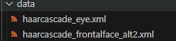
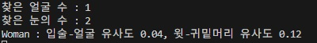
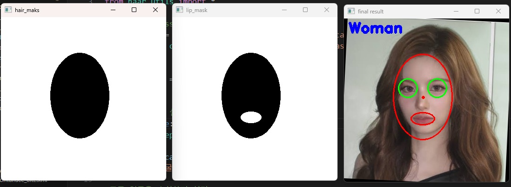

## 🟩 Personal project using cascade classifier

### 📷 #1 Python Code (haar_utils.py, 6_project01.py)



1. First, prepare the cascade classifier files in data folder.

   먼저, 캐스케이드 분류기 파일을 데이터 폴더에 넣습니다.

<br>

2. haar_utils.py -> A code for importing contains various utilities like distinguishing genders  
   6_project01.py -> Main code that should be executed

   haar_utils.py -> 성별 구분 등의 여러 기능이 포함된 임포팅용 코드  
   6_project01.py -> 실행시켜야 하는 메인 코드

```python
# haar_utils.py
# 여러 기능들이 담긴 코드
# 실행시킬 코드에서 import 한 후 함수를 불러오기하면 됨

import cv2
import numpy as np

def preprocessing(fname):
    img = cv2.imread('../img/'+fname, cv2.IMREAD_COLOR)
    
    if img is None :
        return None, None
    
    img_gray = cv2.cvtColor(img, cv2.COLOR_BGR2GRAY)
    
    img_gray = cv2.equalizeHist(img_gray)
    
    return img, img_gray

def correct_image(img, face_center, eye_centers):
    pt0, pt1 = eye_centers
    
    if pt0[0] > pt1[0]:
        pt0, pt1 = pt1, pt0
    dx, dy = np.subtract(pt1, pt0)
    
    angle = cv2.fastAtan2(float(dy), float(dx))
    
    rot_matrix = cv2.getRotationMatrix2D((float(face_center[0]), float(face_center[1])), angle, 1)
    size = img.shape[1::-1]
    img_correction = cv2.warpAffine(img, rot_matrix, size, cv2.INTER_CUBIC)
    
    eye_centers = np.expand_dims(eye_centers, axis=0)
    eye_correct_centers = cv2.transform(eye_centers, rot_matrix)
    eye_correct_centers = np.squeeze(eye_correct_centers, axis=0)
    
    return img_correction, eye_correct_centers


def define_roi(pt, size):
    return np.ravel((pt, size)).astype('int')

def detect_object(center, face):
    w, h = np.array(face[2:4])
    center = np.array(center)
    
    gap_face = np.multiply((w, h), (0.45, 0.65))
    pt_face_start = center - gap_face
    pt_face_end = center + gap_face
    hair = define_roi(pt_face_start, pt_face_end - pt_face_start)
    
    size = np.multiply(hair[2:4], (1, 0.4))
    hair_upper = define_roi(pt_face_start, size)
    hair_lower = define_roi(pt_face_end - size, size)
    
    gap_lip = np.multiply((w, h), (0.18, 0.10))
    lip_center = center +(0, int(h*0.3))
    
    pt_lip_start = lip_center - gap_lip
    pt_lip_end = lip_center + gap_lip
    
    lip = define_roi(pt_lip_start, pt_lip_end - pt_lip_start)
    
    return [hair_upper, hair_lower, lip, hair]

def draw_ellipse(img, roi, ratio, color, thickness=cv2.FILLED):
    x, y, w, h = roi
    center = (x+w//2, y+h//2)
    size = (int(w*ratio), int(h*ratio))
    cv2.ellipse(img, center, size, 0, 0, 360, color, thickness)
    return img

def make_masks(rois, shape):
    base_mask = np.full(shape, 255, np.uint8)
    
    hair_mask = draw_ellipse(base_mask, rois[3], 0.45, 0)
    cv2.imshow('hair_maks', hair_mask)
    
    lip_mask = draw_ellipse(np.copy(hair_mask), rois[2], 0.40, 255)
    cv2.imshow('lip_mask', lip_mask)
    
    masks = [hair_mask, hair_mask, lip_mask, ~lip_mask]
    masks = [mask[y:y+h, x:x+w] for mask, (x, y, w, h) in zip(masks, rois)]
    
    return masks

def calc_histo(img, rois, masks):
    bsize = (64, 64, 64)
    ranges = (0, 256, 0, 256, 0, 256)
    sub_imgs = [img[y:y+h, x:x+w] for x, y, w, h in rois]
    
    hists = [cv2.calcHist([sub_img], [0, 1, 2], mask, bsize, ranges, 3)
             for sub_img, mask in zip(sub_imgs, masks)]
    hists = [h/np.sum(h) for h in hists]
    
    sim_face_lip = cv2.compareHist(hists[2], hists[3], cv2.HISTCMP_CORREL)
    sim_hair = cv2.compareHist(hists[0], hists[1], cv2.HISTCMP_CORREL)
    return sim_face_lip, sim_hair

def classify_gender(img, sims):
    criteria = 0.25 if sims[0] > 0.2 else 0.1
    gender = 'Woman' if sims[1] > criteria else 'Man'
    
    print(gender+' : 입술-얼굴 유사도 %4.2f, 윗-귀밑머리 유사도 %4.2f' %(sims))
    return gender

def display(img, face_center, eye_centers, rois, gender):
    cv2.circle(img, face_center, 2, (0, 0, 255), 2)
    
    cv2.circle(img, tuple(eye_centers[0]), 20, (0, 255, 0), 2)
    cv2.circle(img, tuple(eye_centers[1]), 20, (0, 255, 0), 2)
    
    draw_ellipse(img, rois[2], 0.45, (0, 0, 255), 2)
    draw_ellipse(img, rois[3], 0.45, (0, 0, 255), 2)
    
    cv2.putText(img, gender, (10, 30), cv2.FONT_HERSHEY_DUPLEX, 1.0, (255, 0, 0), 3)
    cv2.imshow('final result', img)

```

---

```python
# 6_project01.py
# 성별 분류 완료
# 전처리 함수 및 보정 이미지 함수 포함

from haar_utils import *

# cascade classifier 로드
face_cascade = cv2.CascadeClassifier('../data/haarcascade_frontalface_alt2.xml')
eye_cascade = cv2.CascadeClassifier('../data/haarcascade_eye.xml')


img, img_gray = preprocessing('sullyoon.jpg')


# 이미지 로드에 실패할 경우 예외(Exception) 발생시킴
if img is None:
    raise Exception('사진을 여는데 실패했습니다.')

faces = face_cascade.detectMultiScale(img_gray)
print('찾은 얼굴 수 : %d' % len(faces))

#모든 얼굴을 순회하며 처리
for (x, y, w, h) in faces:
    # 얼굴의 이미지 영역 자르기
    face_gray = img_gray[y:y+h, x:x+w]
    face_img = img[y:y+h, x:x+w]

    # 눈 인식하기
    eyes = eye_cascade.detectMultiScale(face_gray, 1.1, 2, 0, (30,30), (80,80))
    print('찾은 눈의 수 : %d' % len(eyes))

    if len(eyes) == 2:  # 찾은 눈의 수가 2개일 경우
        face_center = (x+w//2, y+h//2)  # 얼굴의 중심점, // --> 몫을 취함
        # 눈의 중심점들 --> 현재 눈은 2개 찾음
        eye_centers = [(x+ex+ew//2, y+ey+eh//2) for ex,ey,ew,eh in eyes]
        # 보정된 이미지와 보정된 눈의 중심점 구함
        corr_img, corr_eye_centers = correct_image(img, face_center, eye_centers)

        # 머리카락/입술 영역 추출 --> faces[0]은 첫번째 얼굴
        # rois --> [hair upper, hair lower, lip, hair]
        rois = detect_object(face_center, faces[0])
        # 네개의 마스크 구하기, 입력은 네개의 영역과 수정된 이미지의 크기
        # 4개의 영역 --> 윗머리, 귀머리카락, 입술, 얼굴(머리카락)
        masks = make_masks(rois, corr_img.shape[:2])

        # 유사도 계산 및 출력
        sims = calc_histo(corr_img, rois, masks)
        # 남녀 성별 구분 --> 이미지 및 출력문으로 성별 표시
        gender = classify_gender(img, sims)
        # 출력 --> 얼굴, 눈, 입술 주위에 도형 표시
        display(corr_img, face_center, corr_eye_centers, rois, gender)

cv2.waitKey(0)
cv2.destroyAllWindows()

```

---

### 📷 **Result Screenshot:**



<br>



3. According to masking of hair and lip, it determines the gender of person in image.

   머리카락 부분과 입술 부분의 마스킹에 따라 사진 속 인물의 성별을 결정합니다.

<br>