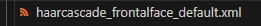

## 🟩 Personal project using mosaic

### 📷 # Python Code (10_project02.py)

---

<br>



1. Prepare the casacade classifier for face detecting.

   얼굴 감지를 위한 캐스케이드 분류기를 준비합니다.

<br>

---

<br>

2. Activate this code.

   코드를 실행하세요.

```python
# 1. casacade 분류기를 통해 얼굴 자동 검출
# 2. 자동 검출된 얼굴 영역을 ROI 설정
# 3. ROI 부분 rate 비율 조정

import cv2

# 얼굴 검출을 위한 Haar cascade 로드
face_cascade = cv2.CascadeClassifier(cv2.data.haarcascades + '../data/haarcascade_frontalface_default.xml')

rate = 15  # 모자이크에 사용할 축소 비율 (1/rate)

# 카메라 캡처 시작
cap = cv2.VideoCapture(1)

while cap.isOpened():
    ret, img = cap.read()
    if not ret:
        break

    gray = cv2.cvtColor(img, cv2.COLOR_BGR2GRAY)
    
    # 얼굴 검출
    faces = face_cascade.detectMultiScale(gray, scaleFactor=1.3, minNeighbors=5, minSize=(80, 80))

    for (x, y, w, h) in faces:
        roi = img[y:y+h, x:x+w]

        # 모자이크 처리 (축소 후 확대)
        roi_face = cv2.resize(roi, (w//rate, h//rate), interpolation=cv2.INTER_LINEAR)
        mosaic = cv2.resize(roi_face, (w, h), interpolation=cv2.INTER_NEAREST)

        # 원래 영상에 모자이크 덮어쓰기
        img[y:y+h, x:x+w] = mosaic

    # 결과 출력
    cv2.imshow("Mosaic Face", img)

    # ESC 키 누르면 종료
    if cv2.waitKey(1) & 0xFF == 27:
        break

cap.release()
cv2.destroyAllWindows()

```

<br>

---

<br>

### 📷 **Result Screenshot:**


3. Detect your face and mosaic directly through camera on live.

   카메라를 통해 실시간으로 직접 얼굴을 감지하고 모자이크합니다.

<br><br>


4. It can also detect and mosaic face on photo.

   사진 속에 있는 얼굴 또한 감지 및 모자이크가 가능합니다.

<br>

---